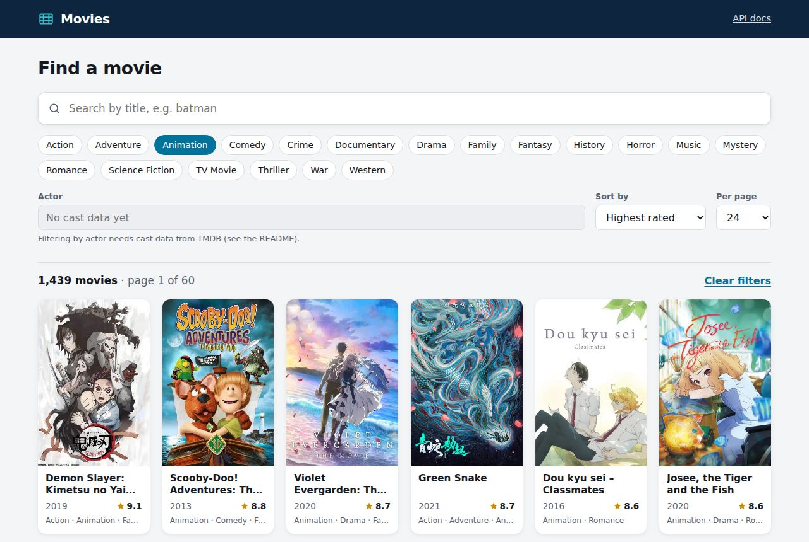
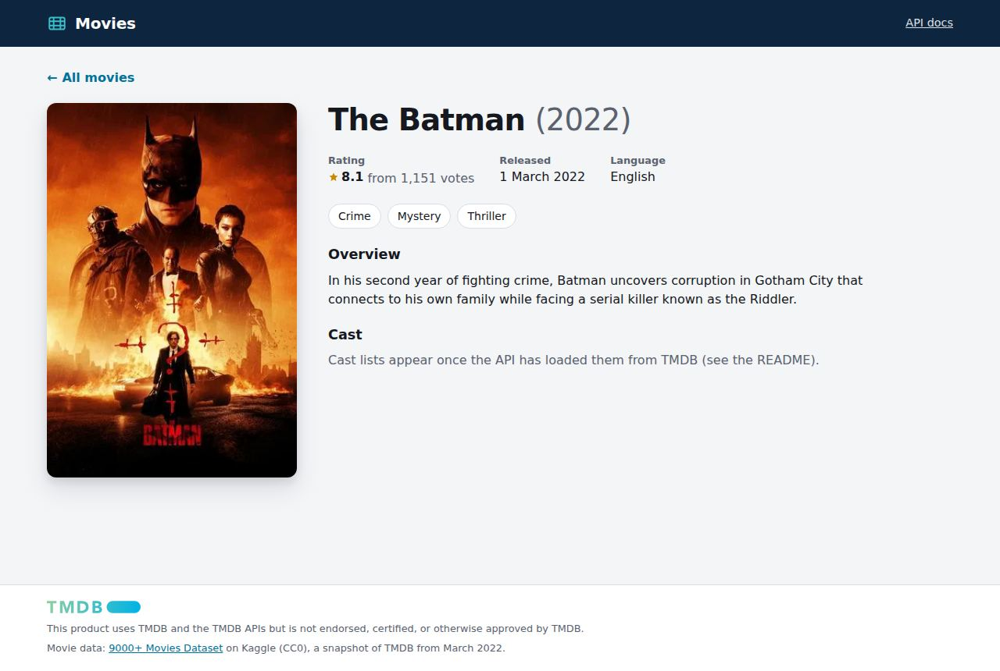

# Movies API

[](https://github.com/abrahamsteep90/optix/actions/workflows/ci.yml)

A REST API for searching the [Kaggle "9000+ Movies" dataset](https://www.kaggle.com/datasets/disham993/9000-movies-dataset),
built with **ASP.NET Core (.NET 10)**, **EF Core** and **PostgreSQL**, plus a **React** website that uses it.

- Search movies by title. Case and accents are ignored, so `pokemon` finds *Pokémon*.
- Choose how many results you get per page and page through them.
- Filter by genre and by actor; sort by popularity, title, release date or rating.
- Extra endpoints: movie details with cast, a genre list, actor search, a health check and OpenAPI/Swagger docs.



## Run it

You need Docker. From the repository root:

```bash
docker compose up --build
```

Then open **http://localhost:8080** for the website, or **http://localhost:5080/swagger** for the API. On the
first start the API creates the database and imports the CSV (9,827 movies); the website starts once the API
reports healthy, which takes about 15 seconds.

| What | Where |
|---|---|
| Website | http://localhost:8080 |
| Swagger UI | http://localhost:5080/swagger |
| OpenAPI document | http://localhost:5080/openapi/v1.json |
| Health check | http://localhost:5080/health |
| PostgreSQL | `localhost:5433`; database, user and password are all `movies` |

`docker compose down` stops everything. Add `-v` to delete the database as well.

### Optional: cast lists from TMDB

The CSV has no actors, so the actor filter needs cast data from [TMDB](https://www.themoviedb.org), where the
dataset itself came from.

1. Create a free TMDB account and copy the **API Read Access Token** from https://www.themoviedb.org/settings/api.
   It's the long token, not the short "API Key".
2. Run `cp .env.example .env` and paste the token after `TMDB_API_TOKEN=`.
3. Run `docker compose up --build` again.

The API is usable straight away. Cast lists load in the background, most popular movies first. Loading all of
them takes about 20 minutes, because the app stays at 20 requests a second. Without a token everything else
works; actor filters just find nothing.

Cast data isn't committed to this repository. [TMDB's terms](https://www.themoviedb.org/api-terms-of-use) don't
allow keeping their data for more than six months or passing it on, so each installation fetches its own copy
and refreshes anything older than 150 days.

## API

| Method | Path | |
|---|---|---|
| GET | `/api/movies` | Search, filter, sort and page through movies |
| GET | `/api/movies/{id}` | One movie with its genres and cast |
| GET | `/api/genres` | All genres with their movie counts, e.g. for a genre filter |
| GET | `/api/actors?search=` | Find actors by name, e.g. for an actor filter |
| GET | `/health` | Checks the database connection |

### `GET /api/movies`

Every parameter is optional.

| Parameter | Values | |
|---|---|---|
| `search` | e.g. `batman` | Part of the title. Case and accents are ignored. |
| `genres` | e.g. `genres=Animation&genres=Family` | Only movies with **all** of these genres. |
| `actors` | e.g. `actors=hanks` | Only movies with all of these actors; part of a name is enough. |
| `sortBy` | `popularity` (default), `title`, `releaseDate`, `rating` | |
| `sortDirection` | `asc`, `desc` | Defaults to A–Z for title, highest or newest first for the rest. |
| `page` | `1` (default) or more | |
| `pageSize` | `1` to `100`, default `20` | |

```http
GET /api/movies?search=batman&sortBy=releaseDate&pageSize=2
```

```json
{
  "items": [
    {
      "id": 2,
      "title": "The Batman",
      "releaseDate": "2022-03-01",
      "overview": "In his second year of fighting crime, Batman uncovers corrup...",
      "popularity": 3827.658,
      "voteCount": 1151,
      "voteAverage": 8.1,
      "originalLanguage": "en",
      "posterUrl": "https://image.tmdb.org/t/p/original/74xTEgt7R36Fpooo50r9T25onhq.jpg",
      "genres": ["Crime", "Mystery", "Thriller"]
    },
    {
      "id": 560,
      "title": "Batman: The Long Halloween, Part Two",
      "releaseDate": "2021-07-26",
      "...": "..."
    }
  ],
  "page": 1,
  "pageSize": 2,
  "totalCount": 52,
  "totalPages": 26
}
```

Errors use the standard problem details format (RFC 9457). Invalid parameters get a `400` that names each
problem, for example `"errors": { "pageSize": ["The field PageSize must be between 1 and 100."] }`. An unknown
movie id gets a `404`. Unexpected failures get a `500`, or a `503` when the database is unreachable. The details
are logged on the server, never sent to the client.

## The website



A single-page app in `src/movies-web`, built with **React 19**, **TypeScript** and **Vite**.

- **Everything is in the URL**, e.g. `/?search=batman&genres=Animation&sortBy=releaseDate&page=2`. Searches can be
  bookmarked and shared, and the back button works. The URL uses the same parameter names as the API.
- **Search waits until you stop typing** (300 ms), so the API isn't called for every key press.
- **[TanStack Query](https://tanstack.com/query)** caches answers and keeps the current page visible while the next
  one loads.
- **Genre toggles, an actor search with suggestions** (keyboard friendly), sorting, page size and real page links.
- **Small posters.** The dataset links to full-size posters (often 1–2 MB). The site asks TMDB's image CDN for the
  size it needs (about 60 KB), and loads them lazily.
- **A page per movie** with its details and cast. The broken CSV row's description keeps its line breaks.
- Light and dark mode follow the system setting, and the layout works on phones.

In Docker, nginx serves the built site and forwards `/api` to the API container, so the browser only talks to
one address (no CORS needed). In development, Vite's dev server does the same (see below).

## Architecture

A light version of Clean Architecture: four .NET projects, with dependencies pointing inwards, plus the website.

```
Movies.Api ──────────────► Movies.Application ──► Movies.Domain
    │                              ▲
    └──► Movies.Infrastructure ────┘   (implements the Application's interfaces)

movies-web (React) ── HTTP ──► Movies.Api
```

| Project | What it does |
|---|---|
| `src/Movies.Domain` | Entities (`Movie`, `Genre`, `Actor`, `CastMember`) and how text is normalised for search. No dependencies. |
| `src/Movies.Application` | The use cases: validating and cleaning up queries, paging, response models, and the repository interfaces. |
| `src/Movies.Infrastructure` | EF Core and PostgreSQL (queries, migrations), the CSV import, and the TMDB client with its background cast sync. |
| `src/Movies.Api` | HTTP: controllers, error handling, OpenAPI, the health check and startup. |
| `src/movies-web` | The React website, and the nginx setup that serves it in Docker. |
| `tests/` | Unit tests and integration tests (see below). |
| `data/mymoviedb.csv` | The dataset, unchanged from Kaggle. |

Some things are left out on purpose, because the brief asks to keep it simple:
- **No MediatR or CQRS.** For a read-only API with four endpoints they add indirection without adding value.
- **No AutoMapper.** Repositories project straight into the response models, so each query reads only the columns it needs.
- **No generic repository.** EF Core's `DbContext` already plays that role; the repository interfaces here are small and specific.

## About the data

Things found in the dataset and how they're handled:

- **One row breaks normal CSV readers.** "Pixie Hollow Bake Off" has line breaks inside an unquoted description.
  A standard CSV reader turns it into 11 rows (9,837 "movies"), and even Kaggle's own column statistics get it
  wrong. The importer only treats `\n` as the end of a row, so it reads **9,827** movies.
- **Titles repeat.** There are remakes, e.g. four "Beauty and the Beast", so movies get their own ids. Every sort ends with the
  id, so paging never shows a movie twice or skips one.
- **100 movies have no votes.** Their rating is `null` instead of `0.0`, and they always sort last by rating.
- **Accents and special letters.** Search ignores them, so `aeon` finds *Æon Flux*. Lower-casing uses the invariant
  culture on purpose: with a Turkish culture, `"I".ToLower()` gives a dotless `ı`.
- **`%` and `_` appear in titles**, e.g. "100% Wolf" and "Shiny_Flakes". They're escaped in the SQL `LIKE` patterns, so
  they match literally.
- **Sorting by title.** The Alpine PostgreSQL image sorts text by raw bytes, which puts "Zorro" before "a bug's life".
  Titles use an ICU collation, so A–Z works the same everywhere.
- **It's a snapshot.** The data was taken from TMDB in March 2022 and is CC0 on Kaggle, so ratings and popularity
  differ from TMDB today.

## Tests

```bash
dotnet test
```

- **Unit tests** (`tests/Movies.UnitTests`) cover:
  - the CSV import, including the broken row, Windows line endings and a Turkish culture;
  - search normalisation, query validation and paging maths;
  - TMDB matching rules and the TMDB client.
- **Integration tests** (`tests/Movies.IntegrationTests`) run the real API against a real PostgreSQL started in
  Docker by [Testcontainers](https://dotnet.testcontainers.org). The database holds 14 real rows from the
  dataset, and a fake TMDB supplies the cast. These tests need Docker running.
- **Website tests** (`src/movies-web`, [Vitest](https://vitest.dev) and Testing Library) render the real pages
  against a fake API: search, filters, paging, empty and error states, and the movie page. Run them with
  `npm test` in `src/movies-web`.

GitHub Actions runs all three suites, lints the website and builds the Docker images on every push.

## Running without Docker

Useful for debugging. You need the .NET 10 SDK and Node.js 22.22 or later; Docker is still used for the database:

```bash
docker compose up -d db
dotnet run --project src/Movies.Api          # API on http://localhost:5080/swagger

cd src/movies-web
npm install
npm run dev                                  # website on http://localhost:5173
```

The dev server forwards `/api` to `http://localhost:5080`; set `API_URL` to use another address.

To add a migration, run `dotnet tool restore` once, then:

```bash
dotnet ef migrations add <Name> --project src/Movies.Infrastructure --startup-project src/Movies.Api --output-dir Persistence/Migrations
```

## Trade-offs and next steps

- **Migrations run on startup**, so `docker compose up` just works. In production they would run as a separate
  deployment step, for example as an EF Core migration bundle.
- **Offset paging** keeps page numbers easy for clients. For very deep pages on a much bigger table, keyset paging
  would be faster.
- **Read-only, so no authentication.** Write endpoints would need authentication (e.g. JWT) and request validation.
- **Ideas for next steps:** caching for `/api/genres`, rate limiting, API versioning, full-text search over the
  descriptions, and OpenTelemetry tracing.

## Credits

- Data: [9000+ Movies Dataset](https://www.kaggle.com/datasets/disham993/9000-movies-dataset) by Isham Rashik, CC0.
- Cast data and images: [TMDB](https://www.themoviedb.org). This product uses TMDB and the TMDB APIs but is not
  endorsed, certified, or otherwise approved by TMDB.
